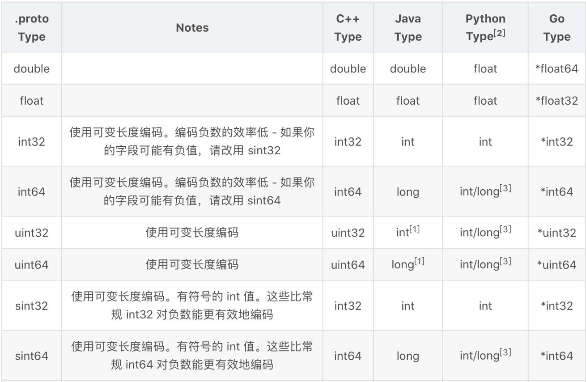
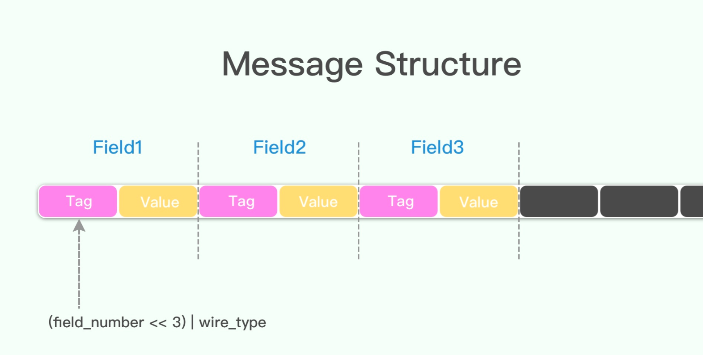
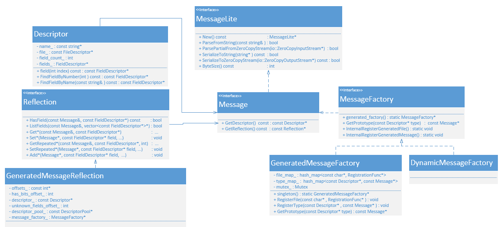

# protobuf


# 1.What is protobuf
- Protocol Buffer(a.k.a. protobuf)  is a cross-platform data   serialization tools proudly published by google.  
- Protobuf is invented for data define(usually called interface defining language), you can define you structured data once, read and write it using a variety of languages.  
- Protobuf currently support generated code in java, Python, Objcective-C, and C++. Proto3 also support Dart, Go, Ruby and C#.

# 2.QuickView  
The tutorial provides a basic C++ programmer's introduction to working with protobuf. By walking throw creating a simple example, it'll shows you:  
-  defining data formats using protobuf.
-  use the protobuf compiler -- protoc.
- use the C++ protobuf api to read and wrire messages.

## 2.1 Defning a Message Type
Let's say we want to define a simple user info request message, where each request  has address, an ID number, and a birthday.

We can define our request using protobuf like this:
```
syntax ='proto2'
message UserRequest {
    required string address = 1;
    optional int    id      = 2;
    optional int    birth   = 3;
}
```  

It has 3 fileds which contains a key/value pairs.  
Each filed has a rule, type , name and a unique serilization number(index of the field in the structure).


# 2.2 Field Rules 
You can specify the message by the following rules:
- `required`: the field type must occoured and have exactly occoured once
- `optional`: the type can occoured less than once, that means the  field type can occoured once, or not occoured.
- `repeated`: for duplicated scalar type. Field specified by the rule means it can be a array, occoured any number of times(include zero)

For historical reasons, repeated fields of scalar numeric types aren't encoded as efficiently as they could be. New code should use the special option [packed=true] to get a more efficient encoding. For example:  

```
repeated int32 samples = 4 [packed=true];
```
# 2.3 type
Scalar Value Types
A scalar message field can have one of the following types – the table shows the type specified in the .proto file, and the corresponding type in the automatically generated class:
```
.proto Type	Notes	C++ Type	Java Type	Python Type[2]	Go Type
double		double	double	float	*float64
float		float	float	float	*float32
int32	Uses variable-length encoding. Inefficient for encoding negative numbers – if your field is likely to have negative values, use sint32 instead.	int32	int	int	*int32
int64	Uses variable-length encoding. Inefficient for encoding negative numbers – if your field is likely to have negative values, use sint64 instead.	int64	long	int/long[3]	*int64
uint32	Uses variable-length encoding.	uint32	int[1]	int/long[3]	*uint32
uint64	Uses variable-length encoding.	uint64	long[1]	int/long[3]	*uint64
sint32	Uses variable-length encoding. Signed int value. These more efficiently encode negative numbers than regular int32s.	int32	int	int	*int32
sint64	Uses variable-length encoding. Signed int value. These more efficiently encode negative numbers than regular int64s.	int64	long	int/long[3]	*int64
fixed32	Always four bytes. More efficient than uint32 if values are often greater than 228.	uint32	int[1]	int/long[3]	*uint32
fixed64	Always eight bytes. More efficient than uint64 if values are often greater than 256.	uint64	long[1]	int/long[3]	*uint64
sfixed32	Always four bytes.	int32	int	int	*int32
sfixed64	Always eight bytes.	int64	long	int/long[3]	*int64
bool		bool	boolean	bool	*bool
string	A string must always contain UTF-8 encoded or 7-bit ASCII text.	string	String	unicode (Python 2) or str (Python 3)	*string
bytes	May contain any arbitrary sequence of bytes.	string	ByteString	bytes	[]byte
```


# 2.4 Optional filed and defalult value
As mentioned above, elements in a message description can be labeled optional. A well-formed message may or may not contain an optional element. When a message is parsed, if it does not contain an optional element, the corresponding field in the parsed object is set to the default value for that field. The default value can be specified as part of the message description. For example, let's say you want to provide a default value of 10 for a SearchRequest's result_per_page value.  

```
optional int32 result_per_page = 3 [default = 10];
```

If the default value is not specified for an optional element, a type-specific default value is used instead: for strings, the default value is the empty string. For bytes, the default value is the empty byte string. For bools, the default value is false. For numeric types, the default value is zero. For enums, the default value is the first value listed in the enum's type definition. This means care must be taken when adding a value to the beginning of an enum value list. See the Updating A Message Type section for guidelines on how to safely change definitions.


When you're defining a message type, you might want one of its fields to only have one of a pre-defined list of values. For example, let's say you want to add a corpus field for each SearchRequest, where the corpus can be UNIVERSAL, WEB, IMAGES, LOCAL, NEWS, PRODUCTS or VIDEO. You can do this very simply by adding an enum to your message definition - a field with an enum type can only have one of a specified set of constants as its value (if you try to provide a different value, the parser will treat it like an unknown field). In the following example we've added an enum called Corpus with all the possible values, and a field of type Corpus:  

```
message SearchRequest {
  required string query = 1;
  optional int32 page_number = 2;
  optional int32 result_per_page = 3 [default = 10];
  enum Corpus {
    UNIVERSAL = 0;
    WEB = 1;
    IMAGES = 2;
    LOCAL = 3;
    NEWS = 4;
    PRODUCTS = 5;
    VIDEO = 6;
  }
  optional Corpus corpus = 4 [default = UNIVERSAL];
}

```

You can define aliases by assigning the same value to different enum constants. To do this you need to set the allow_alias option to true, otherwise protocol compiler will generate an error message when aliases are found.
```
enum EnumAllowingAlias {
  option allow_alias = true;
  UNKNOWN = 0;
  STARTED = 1;
  RUNNING = 1;
}
enum EnumNotAllowingAlias {
  UNKNOWN = 0;
  STARTED = 1;
  // RUNNING = 1;  // Uncommenting this line will cause a compile error inside Google and a warning message outside.
}
```
Enumerator constants must be in the range of a 32-bit integer. Since enum values use varint encoding on the wire, negative values are inefficient and thus not recommended. You can define enums within a message definition, as in the above example, or outside – these enums can be reused in any message definition in your .proto file. 

Reserved Values
If you update an enum type by entirely removing an enum entry, or commenting it out, future users can reuse the numeric value when making their own updates to the type. This can cause severe issues if they later load old versions of the same .proto, including data corruption, privacy bugs, and so on. One way to make sure this doesn't happen is to specify that the numeric values (and/or names, which can also cause issues for JSON serialization) of your deleted entries are reserved. The protocol buffer compiler will complain if any future users try to use these identifiers. You can specify that your reserved numeric value range goes up to the maximum possible value using the max keyword.

```
enum Foo {
  reserved 2, 15, 9 to 11, 40 to max;
  reserved "FOO", "BAR";
}
```


# 2.5 Serilization number
- each field in a message definition has a unique number. 
The numbers are used to identified ithe fields in the message type, and should not change once the message is in use.
- fields numer range 1 though 15 take one byte to encode, Field numbers in the range 16 through 2047 take two bytes. So you should reserve the field numbers 1 through 15 for very frequently occurring message elements. Remember to leave some room for frequently occurring elements that might be added in the future.
- The smallest field number you can specify is 1, and the largest is 229 - 1, or 536,870,911. You also cannot use the numbers 19000 through 19999 (FieldDescriptor::kFirstReservedNumber through FieldDescriptor::kLastReservedNumber), as they are reserved for the Protocol Buffers implementation - the protocol buffer compiler will complain if you use one of these reserved numbers in your .proto. Similarly, you cannot use any previously reserved field numbers.
- 


# encoding format of protobuf 
- variant encofing
- minus encoding


# 3. reflection


# 4.Complex Importing Definition
In the above example, the Result message type is defined in the same file as SearchResponse – what if the message type you want to use as a field type is already defined in another .proto file?

You can use definitions from other .proto files by importing them. To import another .proto's definitions, you add an import statement to the top of your file:

```
import "pba.proto"
```


# 二进制序列化协议ProtolBuffer
# 1.protobuf的概念和用途
protocol buffers 是一种 语言无关、平台无关、可扩展的序列化结构数据的方法，它可用于通信协议、数据存储等。
- proto2支持 C++, Java, Python, Go 等语言；
- proto3支持C++, C#, Java, Python, Go, Ruby, Objective-C, Dart, PHP 等语言；
- 可以更新数据结构，而不破坏根据旧数据结构编译而成并且已部署的程序。
通常使用protobuf协议将数据结构定义好，并且由protoc自动生成对应语言的数据结构文件，内部包含序列化、反序列化和通用的setter和getter等接口，可以做到定义一次，任意支持的语言调用，满足了不同编程语言之间数据结构互转和通用二进制文件存储的能力

# 2.protobuf的发展历史
在 protocol buffer 之前，服务器请求和响应的格式使用手动进行编组/解组，并支持许多版本的协议。
- 导致许多“丑陋”代码；
`Protocol buffers 最初是在 Google 开发的，用于处理索引服务器请求/响应协议:`
- 可以轻松引入新字段，中间服务器不需要检查数据，可以简单地解析它并传递数据而无需了解所有字段。
- 格式更具自我描述性，可以用各种语言处理（C ++，Java 等）。  

`发展历史`：  
- 自动生成序列化和反序列化代码，避免了手动解析的需要。
- 除了用于短期 RPC（远程过程调用）请求之外，人们还开始使用 protocol buffers 作为一种方便的自描述格式，用于持久存储数据（例如在 Bigtable 中）。
- 服务器 RPC 接口开始被声明为协议文件的一部分，protocol 编译器生成存根类，用户可以使用服务器接口的实际实现来覆盖这些类。  
  
`Protocol buffers 现在是 Google 的数据通用语言：`
- 在撰写本文时，Google 代码树中有 12183 个 .proto 文件，其中一共定义了 48162 种不同的 message 类型。
- 它们既可用于 RPC 系统，也可用于各种存储系统中的数据持久存储。

# 3.使用方法
protobuf的使用方法非常简单，安装好protobuf后只需要
- 1.创建.proto文件，定义数据结构
- 2.使用protoc编译，生成对应语言的接口文件
- 3.在业务代码中调用接口，实现序列化、反序列化和读写等操作
>如果作为通信编码协议数据格式，可以做到扩展协议而不破坏现有的代码

## 3.1基本语法
### 定义一个message
例如我们需要定义一个用户数据类型UserInfo，内有字符串用户名uname, int64用户id，字符串用户地址address，以及嵌套的数组用户特特征feature  
我们可以按如下定义
>字段规则   字段类型 字段名 = 字段编号
```
syntax="proto2";
package user;

message UserFeature {
    repeated int64  feature    = 1; //user feature array
    required string user_type  = 2; //user category
};

```

可以看一下生成的代码：
```
//一些内部类
TableStruct_user_5finfo_2eproto
extern ::PROTOBUF_NAMESPACE_ID::internal::DescriptorTable descriptor_table_user_5finfo_2eproto 
extern user::UserFeatureDefaultTypeInternal _UserFeature_default_instance_;
extern UserInfoDefaultTypeInternal _UserInfo_default_instance_;

//arena相关
template<> ::user::UserFeature* Arena::CreateMaybeMessage<::user::UserFeature>(Arena*);
template<> ::user::UserInfo* Arena::CreateMaybeMessage<::user::UserInfo>(Arena*);


//class user::UserFeature
//repeated int64 feature 
int feature_size() const; //数组大小
void clear_feature();     //清空数组
int64_t feature(int index) const; //获得第index位元素
void set_feature(int index, int64_t value); //设置第index位元素,无数组越界检查
void add_feature(int64_t value);//在数组后面增加元素
const RepeatedField<int64_t>& feature() const;//获得数组
repeatedField<int64_t>* mutable_feature();//获得数组指针

//required string user_type
bool has_user_type() const;          //是否存在元素
void clear_user_type() const;        //清空数组
const ::std::string& user_type const //获取元素
void set_user_type(const std::string& value); //几种setter重载
void set_user_type(std::string&& value);
void set_user_type(const char* value);
void set_user_type(const char* value, size_t size );
std::string* mutable_user_type();//指针
std::string* release_user_type(std::string* user_type);//释放指针
std::string* set_allocated_user_type(const std::string& value);//覆盖原对象value

```

### 字段规则
proto2的字段规则包括以下三种：
- required：必须包含该字段一次。
>推荐`使用特殊选项[packed=true]使该字段高效编码`。该字段谨慎使用：后续如果修改为其他类型字段，可能导致问题。谨慎使用required，该字段谨慎使用，后续如果修改为其他类型字段，可能导致问题：旧reader可能认为新格式缺少该字段不完整从而拒绝或删除。


- optional：可以包含该字段零次或一次（不超过一次） 。
- repeated：可以重复任意多次（包括零次）。
>其中重复值的顺序会被保留。


### 字段编号
- message 定义中的每个字段都有唯一编号。这些数字以 message 二进制格式 标识字段，并且一旦 message 被使用，这些编号就无法再更改。
- 最小字段编号为 1，最大字段编号为 2^29 - 1；
- 19000 到 19999 范围内的数字不能用，为protocol buffers保留字段： FieldDescriptor::kFirstReservedNumber ~ FieldDescriptor::kLastReservedNumber；
- reserved关键字保留的字段编号不能使用；
- 小建议：1-15 需要一个字节进行编码，编码结果包含编号和类型，适用于为非常频繁出现的字段保留；15-1024 需要两个字节进行编码；……

### 字段类型
标量数据类型
- 数值类型
- 布尔类型
- 字符串类型



复合类型
- 枚举类型
`使用场景：为某些字段预设值列表。`
- 每个枚举的定义必须包含一个映射到 0 的常量作为第一个元素。
- 必须有一个 0 值，才可以作为数值类型的默认值。
- 0 值常量必须作为第一个元素，是为了与 proto2 的语义兼容就是第一个元素作为默认值。
- 可以通过为不同的枚举常量指定相同的值来定义别名。
`设置 allow_alias 选项为true。`

```
enum UserType {
  optional allow_alias = true;
  UNKNOWN = 0;
  STARTED = 1;
  RUNNING = 1; //right, alias
}

enum UserType {
  UNKNOWN = 0;
  STARTED = 1;
  RUNNING = 1; //wrong, no alias option
}
```
>由于 enum 值使用 varint 编码 ，负值效率低，因此不推荐使用负值。
可以在 message 中定义 enum，或者将其定义在 message 外部。
后者可以在 .proto文件中的任何 message 定义中重用该enum；
message内部声明的enum类型也可在其他message中使用：
使用语法：MessageType.EnumType 。

### optional 默认值
可以将optional字段设置默认值，将默认值指定为message的一部分
```
message Req {
  required string query = 1;
  optional int64  pn    = 2 [default = 0];
}
```
`如果未为 optional 元素指定默认值，则使用特定于类型的默认值：`
- 字符串类型，空字符串
- 布尔类型，false
- 数值类型，0
- 枚举类型，第一个枚举元素


## 3.2 编译proto文件
### 编译
proto文件相当于接口定义文件(interface definition language)，可以使用protoc解析编译proto文件生成对应语言的代码
```
protoc --proto_path=path  --cpp_out=path  --java_out=dir  --python_out=dir  xxx.proto
```  
`proto_path 指定在解析时导入的查找proto文件的目录`
- 如果省略，则使用当前目录
- 可以通过多次传递proto_path选项来指定导入多个目录，它们将按照顺序查找
- 缩写形式 -I = path  

`可以提供一个或者多个输出`
- --cpp_out,--java_out, --python_out,--go_out分别生成对应语言的文件  

`必须提供一个或者多个proto文件`

### 编译产出
- 对于 C++，编译器从每个 .proto 生成一个 .h 和 .cc 文件，其中包含文件中描述的每种 message 类型对应的类。
- 对于 Java，编译器为每个 message 类型生成一个 .java 文件（类），以及用于创建 message 类实例的特殊 Builder 类。
- 对于Python， 编译器生成一个模块，其中包含 .proto 中每种 message 类型的静态描述符，然后与元类一起使用以创建必要的 Python 数据访问类。
- 对于 Go，编译器会生成一个 .pb.go 文件，其中包含对应每种 message 类型的类型。

## 3.3 常用功能
### reserved保留值
>更新message时，删除或注释掉某些字段；
如果将来再次修改时，新增了编号或名称相同的字段，那么，以后再加载旧版本的时候，可能导致数据损坏、隐私错误等。

- 使用场景：如果通过将字段完全删除或将其注释来更新消息类型，则将来用户更新其消息类型时，可以重用那些字段的编号。如果以后加载相同.proto文件的旧版本，这可能会导致严重问题，包括数据损坏，隐私错误等。
- 解决方法：使用reserved将字段名称或字段编号指定为保留值，以后如果用户尝试使用这些字段标识符，编译器将会报错。
- 注意：同一 reserved 语句中字段名称和字段编号不能混在一行指定。
```
message Foo {
  reserved 2, 15, 9 to 11, 40 to max;
  reserved "foo", "bar";
}
```
### import 导入
`通过 import 导入其他 .proto 中定义的message类型：`
- import  "google/protobuf/message.proto";
- 当前文件中，只能使用在本文件 import 的文件中定义的类型，而不能用import文件中import的类型；  

`import public：`
可以使用import文件中import的定义；  

```
//b.proto
import "a.proto"


//c.proto
import "b.proto"
//c.proto中不可以用a.proto中的message类型
```  

```
b.proto
import public "a.proto"

//c.proto
import "b.proto"
//c.proto中可以使用a.proto中定义的message类型
```

### 嵌套类型
- 可以在message中定义和使用其他message类型。
- 使用 Parent.Type 在父类消息类型之外重用此消息类型。
- message aa中定义了message bb，在message aa外，可通过aa.bb使用message bb类型  

```
message Response {
  message Result {
    required string url = 1;
  }
  repeated Result result = 1;
}

message SomeOtherMessage {
  optional SearchResponse.Result = 1;
}
```

### 更新Message的原则

- 不要修改现有字段的字段编号。
- 新增字段必须是optional或repeated类型，否则解析“旧”消息格式时会出错。
- 如果字段类型和编号保持不变，非必填字段就可以转换为扩展。
- int32, uint32, int64, uint64, bool 是兼容的，意味着可以从一种类型修改为另一种类型而不破坏向前或向后的兼容性。
- sint32和sint64是兼容的，但与其他整数类型不兼容。
- fixed32 与 sfixed32 兼容，fixed64 与 sfixed64 兼容。
- 只要字节是有效的UTF-8，string和bytes就是兼容的。
- 如果字节包含message的编码版本，则嵌入message与bytes兼容。

- optional与repeated兼容。
>给定重复字段的序列化数据作为输入，期望该字段为 optional 的客户端将采用最后一个输入值（如果它是基本类型字段）或合并所有输入元素（如果它是 message 类型字段）。
- 更改默认值通常是正常的，只要你记住永远不会通过网络发送默认值。
如果程序接收到未设置特定字段的消息，则程序将看到该程序的协议版本中定义的默认值。它不会看到发件人代码中定义的默认值。
- 将单个 optional 值更改为 new oneof 的成员是安全且二进制兼容的，但是将任何字段移动到现有oneof中是不安全的。
如果你确定没有代码一次设置多个，则将多个 optional 字段移动到新的 oneof 中可能是安全的。


### extend 扩展
`声明 message 中的一系列字段编号用于第三方扩展。`
- 扩展名是那些未由原始 .proto 文件定义的字段的占位符。这允许通过使用这些字段编号来定义部分或全部字段从而将其它 .proto 文件定义的字段添加到当前 message 定义中。

- 访问扩展字段： SetExtension()，HasExtension()，ClearExtension()，GetExtension()，MutableExtension() , AddExtension()。
- 扩展可以是任何类型，包括message类型，但不能是 oneof 和 map 类型。
```
message Foo {
  extensions 100 to 499;//声明扩展预留字段
}

extend Foo {
  optional int32 bar = 101; //扩展
}
Foo Foo
foo.setExtension(bar, 15);
```

`可以在另一种message内部声明扩展。`
- 唯一的影响是 bar 是在 Baz 的范围内定义。
```
extend Foo {
  optional int32 bar = 101; //扩展
}

message SomeOtherMessage {
  message Foo {
    extension 100 to 199;
  }
}

Foo foo;
foo.setExtension(SomeOtherMessage::bar，100);
```


### oneof
`定义：如果message中包含许多可选字段，且最多只能设置其中的一个字段，使用 oneof 强制执行此行为。`
- oneof 共享内存中的所有字段，节省内存。
- 设置oneof的任何成员将清除所有其他成员。
- 可以使用case()或WhichOneof()方法检查oneof字段中哪个值被设置。
- oneof 中不能使用required, optional, repeated 关键字。
- oneof 字段与常规 optional 方法具有相同的 getter 和 setter。
- oneof 不支持扩展。
- 注意：C++中使用oneof要注意保证代码不会内存崩溃：如果调用了已经被清除的数据|指针，可能导致内存崩溃。
如下proto文件中  
```
syntax = "proto2";
package unite;

message UniteInfo {
    optional int64      uid = 1; //uid
    oneof sex {
        string name = 2;
        int64  id   = 3;
    }
}


//test.cpp
   //test oneof 
    std::cout << "test one of " << std::endl;
    std::cout << std::endl;
    unite::UniteInfo unite_info;
    unite_info.set_id(123);
    unite_info.set_name("haoxiongdi");
    std::cout << unite_info.DebugString();

unite::UniteInfo* info_ptr = unite_info.mutable_id();
info_ptr->set...//注意不要写调用到已经清除的数据
```
test.cpp江会只输出`haoxioangdi`,id的内存被覆盖了


### map
protoc 2.x版本不支持map，3.x支持

`定义：表示关联映射。`
- map<key_type, value_type> map_filed = N;
- key_type 可以是任何整数和字符串类型，但不能是枚举类型。
- value_type 可以是除map之外的任何类型。
- map 不支持扩展；
- map 不能是repeated, optional, required；
- 生成 .proto 的文本格式时，map按键排序；
- 在解析或合并时，如果有重复的map键，则使用最后看到的键。
- 从文本格式解析map时，如果存在重复键，则解析可能会失败


### package包
`可以在 .proto 文件中添加包说明符(可选项)，以防止protobuf message类型之间的名称冲突。然后，可以在使用message时使用包说明符。`

- 在C++中，生成的类包含在C++命名空间中。
- Python中，忽略该指令，因为Python模块是根据它们在文件系统中的位置进行组织的。
- Java中，除非在 .proto 文件中明确提供 java_package选项，否则该包将用作 Java 包。
- Go中，除非在 .proto 文件中指定了go_package选项，否则该包将用作Go包。
- 名称解析：从里向外解析。

```
syntax = "proto2";
package hello
  message SomeMessage{
    required string 
  }


hello::SomeMessage msg;
```


### 选项
`可用选项的完整列表在 google/protobuf/descriptor.proto 中定义。`  
一些选项是文件级选项，这意味着它们应该在顶级范围内编写，而不是在任何消息，枚举或服务定义中。  
一些选项是 message 消息级选项，这意味着它们应该写在 message 消息定义中。  
一些选项是字段级选项，这意味着它们应该写在字段定义中。  

- optimize_for（文件选项）：可以设置为 SPEED，CODE_SIZE 或 LITE_RUNTIME。
>SPEED（默认值）：protocol buffer 编译器将生成 用于对 message 类型进行序列化，解析和执行其他常见操作的代码。此代码经过高度优化。
- CODE_SIZE：protocol buffer 编译器将生成最少的类，并依赖于基于反射的共享代码来实现序列化，解析和各种其他操作。
>生成的代码将比使用 SPEED 小得多，但操作会更慢。
类仍将实现与 SPEED 模式完全相同的公共 API。
此模式在包含大量 .proto 文件的应用程序中最有用，并且不需要所有这些文件都非常快。

- LITE_RUNTIME：protocol buffer 编译器将生成仅依赖于 "lite" -运行时库（libprotobuf-lite 而不是libprotobuf）的类。
>精简版运行时比整个库小得多（大约小一个数量级），但省略了描述符和反射等特定功能。这对于在移动电话等受限平台上运行的应用程序尤其有用。
编译器仍将生成所有方法的快速实现，就像在 SPEED 模式下一样。
生成的类将仅实现每种语言的 MessageLite 接口，该接口仅提供完整 Message 接口的方法的子集。

>SPEED 生成的代码执行效率高，代码编译后占用的空间也更多。
CODE_SIZE 代码执行效率低，占用空间少。
LITE_RUNTIME 执行效率高，占用空间少，以牺牲反射功能为代价。


- cc_generic_service, java_generic_service, py_generic, pb编译器将会根据访问定义判断是否生成C++等语言的抽象服务代码，由于遗留原因，这些默认为 “true”。
- cc_enable_arenas（文件选项）：为 C++ 生成的代码启用 arena allocation。
>Arena Allocation，是一种GC优化技术，它可以有效地减少因内存碎片导致的Full GC，从而提高系统的整体性能。
Arena Allocation是一种非传统的内存管理方法。它通过顺序化分配内存，内存数据分块等特性使内存碎片粗化，有效改善了内存碎片导致的Full GC问题。
    创建一个大小固定的bytes数组和一个偏移量，默认值为0。
    分配对象时，将新对象的data bytes复制到数组中，数组的起始位置是偏移量，复制完成后为偏移量自增data.length的长度，这样做是防止下次复制数据时不会覆盖掉老数据（append）。
    当一个数组被充满时，创建一个新的数组。
    清理时，只需要释放掉这些数组，即可得到固定的大块连续内存。


- message_set_wire_format（消息选项）：如果设置为 true，则消息使用不同的二进制格式。

- packed（字段选项）：如果在基本数字类型的重复字段上设置为 'true`，则一个更紧凑的编码 被使用。
- deprecated（field option）：如果设置为 true，表示该字段已弃用，新代码不应使用该字段。
在大多数语言中，这没有实际效果。


# 4.编码
>message 实际上是一系列的键值对。
message 的二进制版本只使用字段编号作为 key，而字段名称和声明的类型只能通过引用 message 类型的定义（即 .proto 文件）在解码端确定。
在对一个 message 进行编码时，其键值将连接成字节流。
在解码消息时，解析器能够跳过它无法识别的字段。
## message的结构

- tag | key：识别 message 编码中每个字段
- 来自 .proto 文件的字段编号(field_number )；
- 一个提供足够信息以查找 “值的（字节）长度” 的类型(wire type)。
- message 消息流中的每个 tag (field_number + wire_type) 都使用 varint 进行编码，且最后三位 bit 存储类型 wire_type，其它位存储字段编号 field_number。

## Variant编码
Varint 是一种紧凑的表示数字的方法。它用一个或多个字节来表示一个数字，值越小的数字使用越少的字节数。这能减少用来表示数字的字节数。  
>Varint是一种使用一个或多个字节序列化整数的方法，会把整数编码为变长字节。每个字节只是低7位存储数值，最高位作为标识位。
对于32位整型数据经过Varint编码后需要1~5个字节，小的数字使用1个byte，大的数字使用5个bytes。64位整型数据编码后占用1~10个字节
* Varint 中的每个 byte 的最高位 bit 有特殊的含义，如果该位为 1，表示后续的 byte 也是该数字的一部分，如果该位为 0，则结束
* 每个字节的低7位用于以7位为一组存储数字的二进制补码表示，最低有效组在前，或者叫最低有效字节在前。这表明varint编码后数据的字节是按照小端序排列的。

varint也叫可变长编码，一个实现是这样的
```
char* EncodeVarint32(char* dst, uint32_t v) {
  // Operate on characters as unsigneds
  unsigned char* ptr = reinterpret_cast<unsigned char*>(dst);
  static const int B = 128;
  if (v < (1<<7)) {
    *(ptr++) = v;
  } else if (v < (1<<14)) {
    *(ptr++) = v | B;
    *(ptr++) = v>>7;
  } else if (v < (1<<21)) {
    *(ptr++) = v | B;
    *(ptr++) = (v>>7) | B;
    *(ptr++) = v>>14;
  } else if (v < (1<<28)) {
    *(ptr++) = v | B;
    *(ptr++) = (v>>7) | B;
    *(ptr++) = (v>>14) | B;
    *(ptr++) = v>>21;
  } else {
    *(ptr++) = v | B;
    *(ptr++) = (v>>7) | B;
    *(ptr++) = (v>>14) | B;
    *(ptr++) = (v>>21) | B;
    *(ptr++) = v>>28;
  }
  return reinterpret_cast<char*>(ptr);
}
```
Varint 中的每个字节（最后一个字节除外）都设置了最高有效位（msb），这一位表示还会有更多字节出现。每个字节的低 7 位用于以 7 位组的形式存储数字的二进制补码表示，最低有效组首位。  


如果用不到 1 个字节，那么最高有效位设为 0 ，如下面这个例子，1 用一个字节就可以表示，所以 msb 为 0.  
```
0000  0001
```

如果需要多个字节表示，msb 就应该设置为 1 。例如 300，需要两个字节表示，因为一个字节只有7位有效，最高位msb表示后面是否还有更多数据，如果用 Varint 表示的话：
```
1010 1100 0000 0010

1. 100101100 | 10000000 = 1 1010 1100
2. 110101100 >> 7 = 1010 1100
3. 100101100 >> 7 = 10 = 0000 0010
4. 1010 1100 0000 0010 (最终 Varint 结果)
```

`key 的计算方法是 (field_number << 3) | wire_type，换句话说，key 的最后 3 位表示的就是 wire_type。`

- 举例，一般 message 的字段号都是 1 开始的，所以对应的 tag 可能是这样的：
```
000 1000
```
- 末尾 3 位表示的是 value 的类型，这里是 000，即 0 ，代表的是 varint 值。右移 3 位，即 0001，这代表的就是字段号(field number)。tag 的例子就举这么多，接下来举一个 value 的例子，还是用 varint 来举例：

>一个负数一般会被表示为一个很大的整数，因为计算机定义负数的符号位为数字的最高位。如果采用 Varint 表示一个负数，那么一定需要 10 个 byte 长度。为此 Google Protocol Buffer 定义了 sint32 这种类型，采用 zigzag 编码。将所有整数映射成无符号整数，然后再采用 varint 编码方式编码，这样，绝对值小的整数，编码后也会有一个较小的 varint 编码值。


# 5.反射

我们自定义的类继承自protobuf的Message类，包含检查、读写操作，包括了序列化和反序列化操操作：  
## Descriptor 
- Message::GetDescriptor()获取Dsscriptor
- message.descriptor 
```
#include <google/protobuf/descriptor.h>
namespace google::protobuf


```
### Descriptor
  message 内,
  *  可以知道message里有多少个field 
  *  可以 找到message关联的FileDescriptor
  *  根据字段name 或者 字段标号 获得 FieldDescriptor
FileDescriptor * proto文件中定义的所有的message,service 个数，根据索引获得单个
 * proto文件中定义的扩展，enum，options 
 * 编译时就已经在pb.cc 硬编码了 proto文件对应的filedescriptor序列化后的数据
  
```
const std::string &	name() const
获取message名

const std::string &	full_name() const
获取全名，含命名空间

int	index() const
在message在proto文件中的偏移

const FileDescriptor *	file() const
获取proto的文件描述硬编码信息

const Descriptor *	containing_type() const
嵌套类型

void	CopyTo(DescriptorProto * proto) const
拷贝到另外的proto对象中

std::string	DebugString() const
输出便于调试的可见message

//下面是FiledStuff
int	field_count() const
message中filed的个数

const FieldDescriptor *	field(int index) const
第index个Field//从0开始

const FieldDescriptor *	FindFieldByNumber(int number) const
根据proto中定义的序号查抄

const FieldDescriptor *	
FindFieldByName(const std::string & name) const
根据名字查找

const FieldDescriptor *	
FindFieldByLowercaseName(const std::string & lowercase_name) const
小写字母查找

const FieldDescriptor *	
FindFieldByCamelcaseName(const std::string & camelcase_name) const
大写字母查找

int	
oneof_decl_count() const
one_of定义数量


const OneofDescriptor *	
oneof_decl(int index) const
获取oneof

const OneofDescriptor *	
FindOneofByName(const std::string & name) const

int	
nested_type_count() const

const Descriptor *	
nested_type(int index) const

const Descriptor *	
FindNestedTypeByName(const std::string & name) const

同样的，对于Enum，Extension，Reserved等字段也有类似的接口，可以参考pb官方接口文档
https://developers.google.com/protocol-buffers/docs/reference/cpp/google.protobuf.descriptor#FieldDescriptor

```


### FieldDescriptor
 *  cpp 类型，字段名，字段号码
 *  默认值
 * 是 requaired,optional,repeated
 * 编码是否是pack    
```
enum Type//pb使用的类型Type
enum FieldDescriptor::Type {
  TYPE_DOUBLE = = 1,
  TYPE_FLOAT = = 2,
  TYPE_INT64 = = 3,
  TYPE_UINT64 = = 4,
  TYPE_INT32 = = 5,
  TYPE_FIXED64 = = 6,
  TYPE_FIXED32 = = 7,
  TYPE_BOOL = = 8,
  TYPE_STRING = = 9,
  TYPE_GROUP = = 10,
  TYPE_MESSAGE = = 11,
  TYPE_BYTES = = 12,
  TYPE_UINT32 = = 13,
  TYPE_ENUM = = 14,
  TYPE_SFIXED32 = = 15,
  TYPE_SFIXED64 = = 16,
  TYPE_SINT32 = = 17,
  TYPE_SINT64 = = 18,
  MAX_TYPE = = 18
}

enum CppType //c++枚举类型
enum FieldDescriptor::CppType {
  CPPTYPE_INT32 = = 1,
  CPPTYPE_INT64 = = 2,
  CPPTYPE_UINT32 = = 3,
  CPPTYPE_UINT64 = = 4,
  CPPTYPE_DOUBLE = = 5,
  CPPTYPE_FLOAT = = 6,
  CPPTYPE_BOOL = = 7,
  CPPTYPE_ENUM = = 8,
  CPPTYPE_STRING = = 9,
  CPPTYPE_MESSAGE = = 10,
  MAX_CPPTYPE = = 10
}
enum	Label  //规则
enum FieldDescriptor::Label {
  LABEL_OPTIONAL = = 1,
  LABEL_REQUIRED = = 2,
  LABEL_REPEATED = = 3,
  MAX_LABEL = = 3
}

const std::string &	name() const
字段名

const std::string &	
full_name() const
全字段名

const std::string &	
json_name() const

const FileDescriptor *	
file() const
字段所在proto

bool	
is_extension() const
是否是扩展字段

int	
number() const
proto中的序号

Type	
type() const
proto中定义字段类型即enum FieldDescriptor::Type

CppType	
cpp_type() const
c++字段类型即 enum FieldDescriptor::CppType

const char *	
cpp_type_name() const
字段类型字符串

Label	
label() const
字段规则类型

const Descriptor *	
containing_type() const
包含本field的message

const Descriptor *
    FieldDescriptor::extension_scope() const
包含本extension的message

const Descriptor *	
message_type() const
如果字段是message返回Descriptor否则返回nullptr

const EnumDescriptor *
    FieldDescriptor::enum_type() const
If type is TYPE_ENUM, returns a descriptor for the enum.Otherwise, returns null.

bool	
is_required() const

bool	
is_optional() const

bool	
is_repeated() const

bool	
is_packable() const

bool	
is_packed() const

bool	
is_map() const

int	
index() const

bool	
has_default_value() const

const std::string &	
lowercase_name() const
小写名
const std::string &	
camelcase_name() const
大写名


```
### oneof
```
typedef	
OneofDescriptorProto Proto
const std::string &	
name() const
Name of this oneof.

const std::string &	
full_name() const
Fully-qualified name of the oneof.

int	
index() const
Index of this oneof within the message's oneof array.

const FileDescriptor *	
file() const
The .proto file in which this oneof was defined. Never nullptr.

const Descriptor *	
containing_type() const
The Descriptor for the message containing this oneof.

int	
field_count() const
The number of (non-extension) fields which are members of this oneof.

const FieldDescriptor *	
field(int index) const
Get a member of this oneof, in the order in which they were declared in the .proto file. more...

const OneofOptions &	
options() const

void	
CopyTo(OneofDescriptorProto * proto) const
See Descriptor::CopyTo().

std::string	
DebugString() const
See Descriptor::DebugString().

std::string	
DebugStringWithOptions(const DebugStringOptions & options) const
See Descriptor::DebugStringWithOptions().
```

### MethodDescriptor
  * 服务的描述 ServiceDescriptor
  * 输入输出的 Descriptor

### ServiceDescriptor
* 含service名、全名、关联的FileDescriptor等。


```
//字符串
bool ParseFromString(const string& data) //从二进制字符串烦序列化
bool SerializeToString(string* output) const //序列化为二进制字符串
string DebugString()  //Debug字符串，返回可读性的proto元数据 方便debug

数组：SerializeToArray ParseFromArray
string：SerializeToString ParseFromString
文件描述符：SerializeToFileDescriptor ParseFromFileDescriptor
stream流：SerializeToOstream ParseFromIstream
```


```
static const UnknownFields& unknown_fileds() const
static UnknownFieldSet* mutable_unknown_fields() const
static const Descriptor* descriptor()
static const Descriptor* GetDescriptor()
static const Reflection* GetReflection()
static const UserFeature& default_instance()
static void  InitAsDefaultInstance()
```


反射机制：在运行状态中，对于任意一个类，都能知道这个类的所有属性和方法；对于任何一个对象，都能调用它的任何一个方法；这种动态获取信息以及动态调用对象的方法的功能成为反射机制。
反射：在程序运行时，能够知道任意message和service的属性和方法，也可以在运行时调用message的属性和方法。
protobuf：
  serialize_message遍历提取message中各个字段以及对应的值，序列化到string中：
    通过Descriptor得到每个字段的描述符：字段名、字段的cpp类型，通过Reflection的GetX接口获取对应的value。
  parse_message读取field/value，还原message对象：
    通过Descriptor得到每个字段的描述符FieldDescriptor，通过Reflection的SetX填充message。

